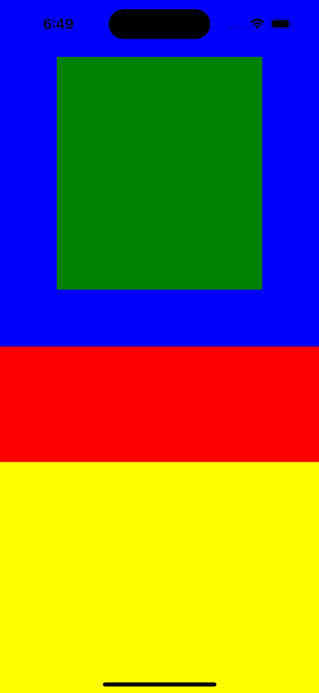
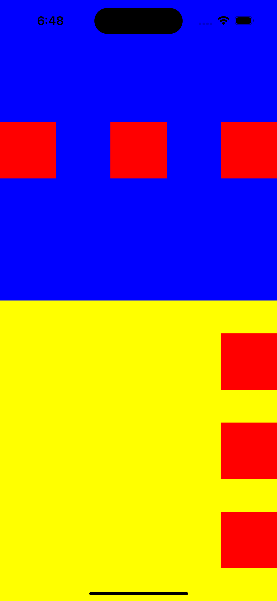
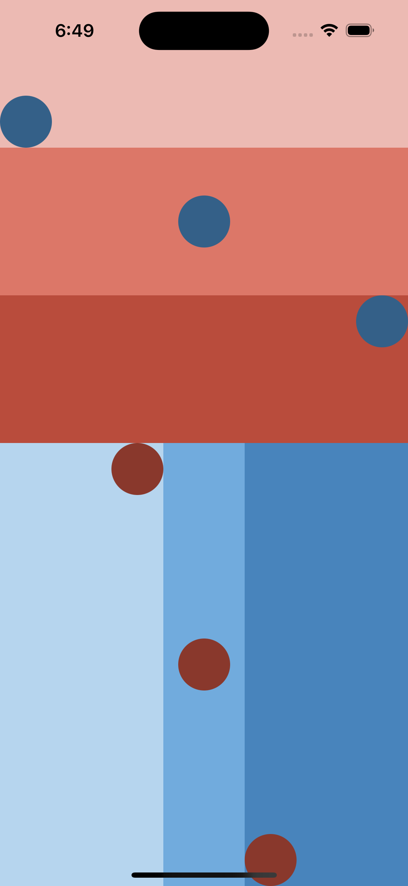

# Exercise 2

[Back to README](README.md)

This time we work with layout and flexbox.

[Link to official documentation.](https://reactnative.dev/docs/flexbox?language=typescript#justify-content)

- `flexDirection` controls the direction in which the children of a node are laid out.
  * `column` ( **default value** ) Align children from top to bottom. If wrapping is enabled, then the next line will start to the right of the first item on the top of the container.
  * `row` Align children from left to right. If wrapping is enabled, then the next line will start under the first item on the left of the container.
  * `column-reverse` Align children from bottom to top. If wrapping is enabled, then the next line will start to the right of the first item on the bottom of the container.
  * `row-reverse` Align children from right to left. If wrapping is enabled, then the next line will start under the first item on the right of the container.

* [`justifyContent`](https://reactnative.dev/docs/layout-props#justifycontent) describes how to align children within the main axis of their container. For example, you can use this property to center a child horizontally within a container with `flexDirection` set to `row` or vertically within a container with `flexDirection` set to `column`.
  * `flex-start`( **default value** ) Align children of a container to the start of the container's main axis.
  * `flex-end` Align children of a container to the end of the container's main axis.
  * `center` Align children of a container in the center of the container's main axis.
  * `space-between` Evenly space off children across the container's main axis, distributing the remaining space between the children.
  * `space-around` Evenly space off children across the container's main axis, distributing the remaining space around the children. Compared to `space-between`, using `space-around` will result in space being distributed to the beginning of the first child and end of the last child.
  * `space-evenly` Evenly distribute children within the alignment container along the main axis. The spacing between each pair of adjacent items, the main-start edge and the first item, and the main-end edge and the last item, are all exactly the same.

- [`alignItems`](https://reactnative.dev/docs/layout-props#alignitems) describes how to align children along the cross axis of their container.
  * `stretch` ( **default value** ) Stretch children of a container to match the `height` of the container's cross axis.
  * `flex-start` Align children of a container to the start of the container's cross axis.
  * `flex-end` Align children of a container to the end of the container's cross axis.
  * `center` Align children of a container in the center of the container's cross axis.
  * `baseline` Align children of a container along a common baseline. Individual children can be set to be the reference baseline for their parents.

## Exercise 1

## Exercise 2

## Exercise 3

